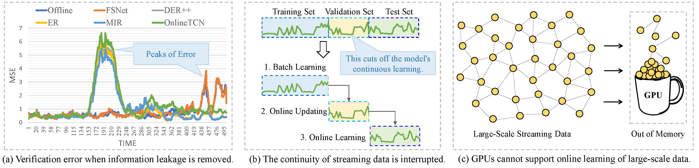
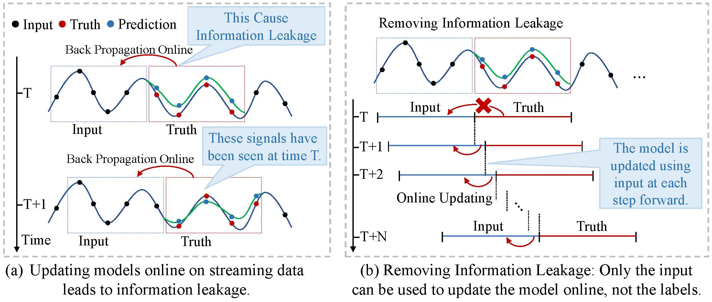
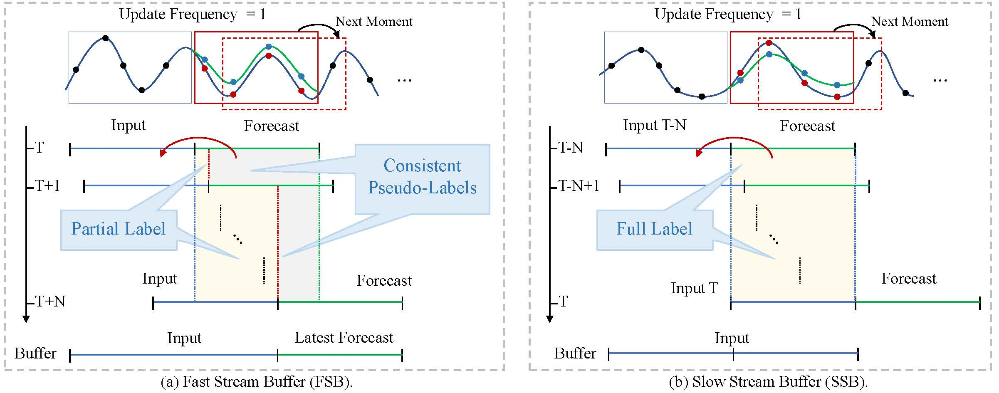
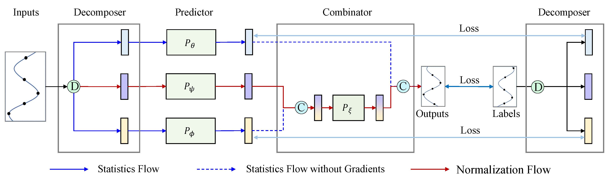
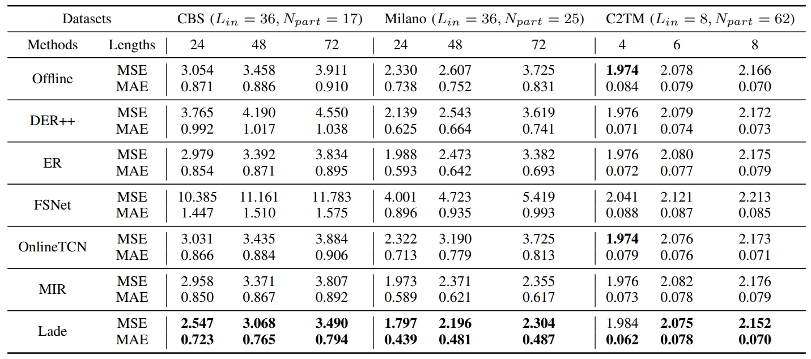
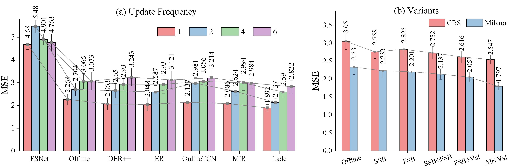
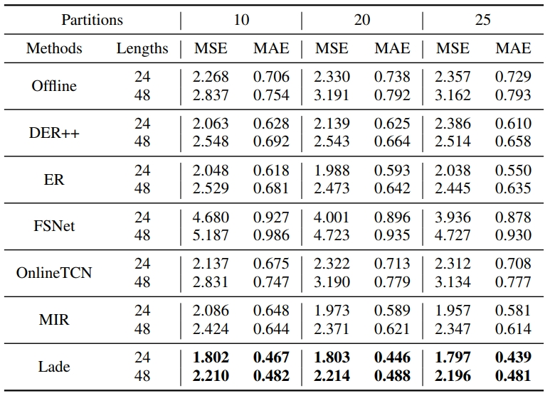
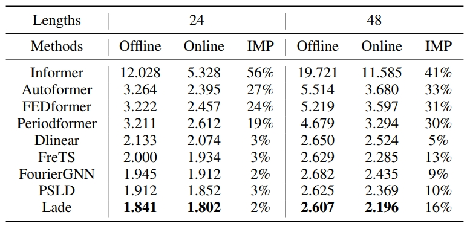
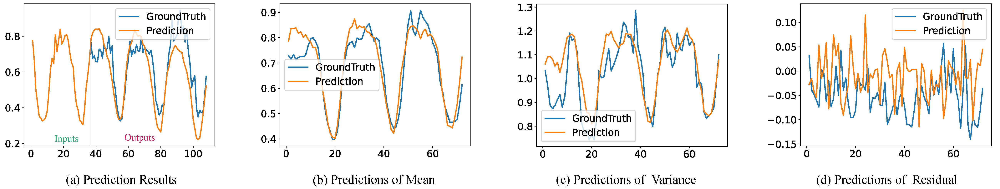

# Act-Now: A Novel Online Forecasting Framework for Large-Scale Streaming Data

The repo is the official implementation for the paper: Act-Now: A Novel Online Forecasting Framework for Large-Scale Streaming Data.

**We propose a novel online learning framework, Act-Now, to improve the online forecasting on large-scale streaming data.**

<div align=center></div>

## 1. Introduction

Existing online forecasting methods have the following issues:

- Do not consider the update frequency of streaming data and directly use labels (future signals) to update the model, leading to information leakage.

- Removing information leakage can exacerbate concept drift, and online parameter updates may damage prediction accuracy.

- Leaving out a validation set cuts off the model's continued learning.

- Existing GPU devices cannot support online learning of large-scale streaming data.

<div align=center></div>

## 2. Contributions

 The **key innovations** are summarized as:
- We introduce a Random Subgraph Sampling (RSS) algorithm designed to enable efficient model training. 

-  We design a Fast Stream Buffer (FSB) and Slow Stream Buffer (SSB) to update model online. FSB updates the model immediately with the consistent pseudo labels and partial labels to avoid information leakage. SSB updates the model in parallel using complete labels from earlier times. 

- We propose a Label Decomposition model (Lade) with statistical and normalization flows to address concept drift.

- We propose to perform online updates on the validation set to ensure the consistency of model learning on streaming data. 

- DistPred can provide K predicted values of the response variable in a single forward pass, allowing for comprehensive statistical insights and uncertainty quantification.

- Extensive experiments demonstrate that the proposed Act-Now framework performs well on large-scale streaming data, with an average 28.4% and 19.5% performance improvement.

<div align=center></div>

## 3. Lade

Lade decomposes a time series into a statistics flow and a normalization flow, utilizing deep models to independently learn the time-varying patterns of each.

<div align=center></div>

The architecture of Lade, which including three main parts: decomposer *D*, predictor *P*, as well as combinator *C*. The decomposer is tasked with decomposing the input series into a statistical flow and a normalization flow. The predictors are employed to model the nonlinear components of the prediction. The combinator integrates the predictions of each component to derive the final output.

## 4. Training and Testing on Large-Scale Streaming Data

### 1) Download the Dataset
The datasets can be obtained from [Google Drive](https://drive.google.com/drive/folders/1ClfRmgmTo8MRlutAEZyaTi5wwuyIhs4k?usp=sharing).

### 2) Clone the code repository
```git
git clone git@github.com:Anoise/Act-Now.git
```

### 3) Training
Go to the directory "Act-Now", we'll find that the bash scripts are all in the 'scripts' folder, then run the bash script like this:
```shell
bash training_scripts/run_large_dataset.sh 
```


## 4. Training and Testing on Small-Scale Streaming Datasets


### 1) Download the Collection of Small Datasets.

The datasets can be obtained from [Google Drive](https://drive.google.com/drive/folders/1ClfRmgmTo8MRlutAEZyaTi5wwuyIhs4k?usp=sharing).


### 2) Clone the code repository
```git
git clone git@github.com:Anoise/Act-Now.git
```

### 3) Training on Time Series Dataset
Go to the directory "Act-Now", you'll finds that the bash scripts are all in the 'scripts' folder, then run the bash script like this:

```shell
bash training_scripts/run_small_dataset.sh
```

Note that:
- Model was trained with Python 3.10 with CUDA 11.4.
- Model should work as expected with pytorch >= 2.1 support was recently included.


## 5. Main Results


The online forecasting results for large-scale streaming datasets are summarized in above table, which presents the cumulative performance of different baselines in terms of MSE and MAE. 
**It is evident that Lade consistently achieves state-of-the-art (SOTA) performance across all datasets and prediction length settings.**

<div align=center></div>


## 6. Ablation Studies on the Update Frequency

The update frequency determines the availability of labels over time and the timing of model updates, which is crucial for online forecasting methods. We conduct ablation studies on the update frequency of streaming data using the Milano dataset.
**It can be observed that as the update frequency of streaming data increases, the model's performance gradually improves.**

## 7. Ablation Studies on the Components of Lade

We conduct comprehensive ablation studies encompassing both component replacement and component removal experiments.
**It becomes evident that the model's average performance is superior when employing SSB, FSB, and Val (online updates on the validation set).**

<div align=center></div>


## 8. Ablation Studies on Subgraph Partitioning

We conducted ablation experiments with different subgraph sizes on the Milano datasets. **The experimental findings indicate that the model's performance is stable across different subgraph sizes**, reinforcing the robustness of the subgraph partitioning.

<div align=center></div>


## 9. Versatility of Act-Now Framework

Our observations indicate that the Act-Now framework significantly enhances the predictive performance of these advanced models.

<div align=center></div>


## 10. Visualization the Learning Process of Lade


The intrinsic feature of Lade lies in its alignment of each component’s output with the structure of the label’s decompositions.

<div align=center></div>


## 11. Citations

Daojun Liang, Haixia Zhang, Jing Wang, Dongfeng Yuan and Minggao Zhang, Act-Now: A Novel Online Forecasting Framework for Large-Scale Streaming Data. arXiv preprint arXiv:2412.xxxx (2024).

```
@article{liang2024actnow,
  title={Act-Now: A Novel Online Forecasting Framework for Large-Scale Streaming Data},
  author={Daojun Liang, Haixia Zhang, Jing Wang, Dongfeng Yuan and Minggao Zhang},
  journal={arXiv preprint arXiv:2412.xxxx},
  year={2024}
}
```
<!--
-->

